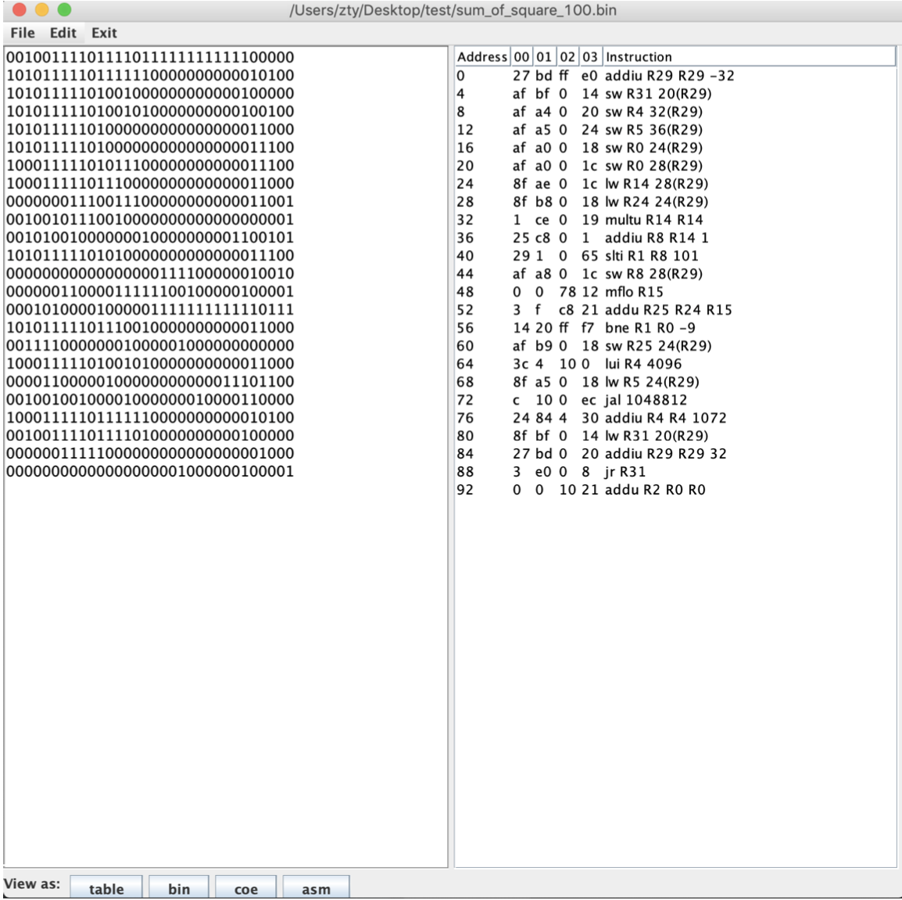

# MIPS Assembler IDE

## Introduction

This is a MIPS assembler IDE. Supports the conversion of 3 file formats: asm, bin, coe.

## Get Started

There are 3 subdirectories: TestCases, IdeaProject and CommandLineProject.

### TestCases

This directory contains test cases.

### IdeaProject

Open and build with IntelliJ Idea.

### CommandLineProject

Run following commands:

`cd ./CommandLineProject`

`javac *.java; java Editor`

## Screenshots

See `MIPS_IDE_report.pdf` for details.

Assembler:

## 

Disassembler:

