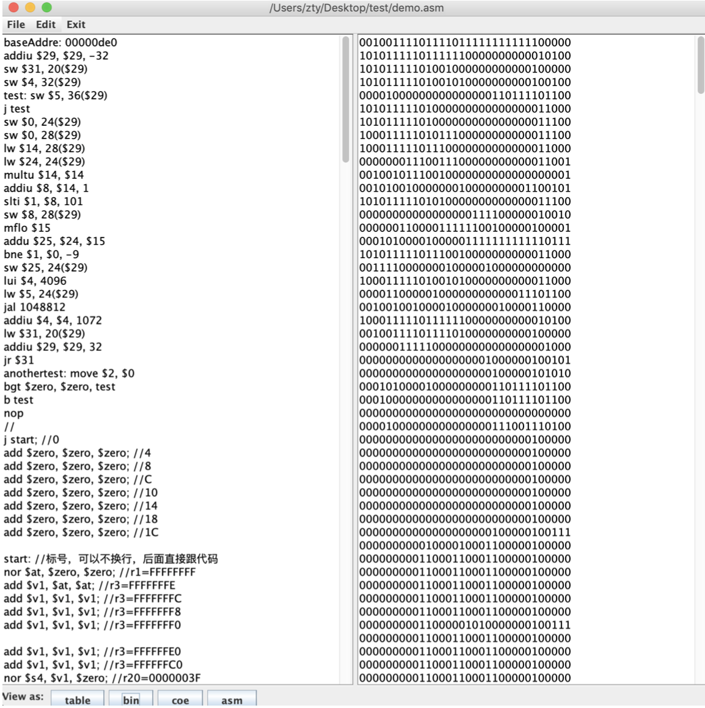

# MIPS Assembler IDE

## Introduction

This is a simple MIPS assembler IDE.

**Functionalities:** assembling and disassembling.

**Supported instructions:** 128 MISP R2000 integer pseudo/instructions
* [List of instructions](https://github.com/ztyreg/JAssembler/blob/master/CommandLineProject/mips_int.csv)
* [List of pseudoinstructions](https://github.com/ztyreg/JAssembler/blob/master/CommandLineProject/mips_pseudo.csv).

**Supported file formats:** asm, bin, coe (input and output).

See [MIPS_IDE_report.pdf](./MIPS_IDE_report.pdf) for details (in Chinese).

## Get Started

There are 3 subdirectories: TestCases, IdeaProject and CommandLineProject.

###### TestCases:

This directory contains test cases.

###### IdeaProject

Open and build with IntelliJ Idea.

###### CommandLineProject

Run following commands:

`cd ./CommandLineProject`

`javac *.java; java Editor`

## Screenshots

Assembler:

## 

Disassembler:

## Features

See [MIPS_IDE_report.pdf](./MIPS_IDE_report.pdf) for details (in Mandarin).

